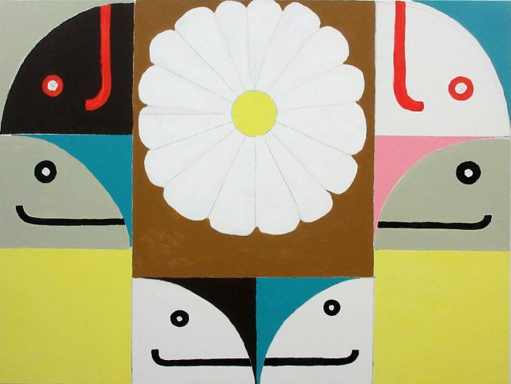

[](https://hvw8.com/exhibitions/artists/mark-gonzales)

[](https://hex.pm/packages/gonz) [](https://travis-ci.org/vorce/gonz)

# gonz

> I can write anything and just put it in a zine, and then it's out there. It is like blogging but on paper. It is what I started to do before the computers were all popular.

Static site generator. **Heavily** inspired by Obelisk (thanks for a great project!).

## Quick start

`mix new mysite`

```elixir
defp deps do
  [
    {:gonz, "~> 2.0"}
  ]
end
```

    mix deps.get
    mix deps.compile
    mix gonz.new MyAwesomeSite
    mix gonz.build

Open [build/index.html](build/index.html) in your browser.

## Goals

Some things I've had in mind while hacking on gonz:

- Use case: personal homepage with blog like posts, and static pages.
- Write posts and pages in [Markdown](http://daringfireball.net/projects/markdown/syntax).
- Support themes / templates with [EEx](https://hexdocs.pm/eex/EEx.html) only. I doubt I will add support for anything else
- Simple to use and get started with, using [mix](https://hexdocs.pm/mix/Mix.html) tasks
- Few dependencies
- Clarity over performance. Performance shouldn't be horrible, but is not a top priority at this point.

## Features

- Write pages and posts in Markdown
- "Themes" with EEx templates
- A page can be marked as a navigation item, which can be handled in the templates
- Front matter is specified as an elixir map

## Mix tasks

These are the most common ways to interact with gonz while building your site.

### `gonz.new [site-name]`

Creates a new gonz project/site.

Arguments:
- site-name: Optional name of the site to create, just determines how the bootstrapped site will look.

### `gonz.post <post-title>`

Creates a new post in `posts/` with the specified title.

Example: `mix gonz.post "My amazing post about Things"`

Arguments:
- post-title: Required title of the post

### `gonz.build [theme-name] [output-directory]`

Builds the site.

Arguments:
- theme-name: Optional name of the theme to use, defaults to "default"
- output-directory: Optional name of the build/output directory. Defaults to "./build"

### `gonz.purge [output-directory]`

Removes all files related to the site. This can give you a fresh start. Mostly used for manual testing new sites easily.

Arguments:
- output-directory: Optional name of the build/output directory. Defaults to "./build"

### Planned tasks

`mix gonz.page title`

### Themes

The easiest way to create your own theme is to copy the default one, and use it as a reference on how and what data is available. Example of a custom theme can be seen in [forvillelser](https://github.com/vorce/forvillelser)

The exact API for themes are subject to change. The available data for the theme templates are returned by  [`Document.to_assigns/1`](https://github.com/vorce/gonz/blob/master/lib/gonz/document.ex#L55)

#### Building your site with a non-default theme

**If you use a custom theme, don't forget to specify the name of it when you build your site, ex: `mix gonz.build mythemename build`**

If this gets repetitive I suggest you create a target in a Makefile.

## Github pages howto

- Enable github pages for your project (pick "Master branch /docs folder" source option)
- Create a `docs` dir in your project root
- When building the site make sure you specify the docs dir as the output directory: `mix gonz.build <theme> docs`
- Add all files in `docs` and commit, push. 🎉

## Netlify howto

Even simpler! My own site uses Netlify, so you can copy the Makefile in [Forvillelser](https://github.com/vorce/forvillelser).

- Then configure the project in netlify to use `make` as the build command, and `build` as the publish directory.
- Now all you need to do is write your posts, commit and push them and netlify will build the site and publish it. 🎉

## Why

Why create something new instead of using Obelisk, Serum, or Coil?

Short answer: Fun, learning, and flexibility.

Longer answer: I checked out all of these projects. Out of the three I really liked how Obelisk looked to use,
but it did not compile out of the box. Once changing some dependencies (plug), it compiled, but when running it crashed.
I looked closer at the github page and noticed that the project was a bit abandoned. Then I figured  "meh, let's code"!

## Todo

- What about drafts..
- Rethink code structure, can simplify a lot of things and make it more consistent I think.
- Low hanging speed ups (Task.async?)
- Assets. Right now it's all or nothing. What if I want to publish a separate page that needs some assets that nothing else needs?
